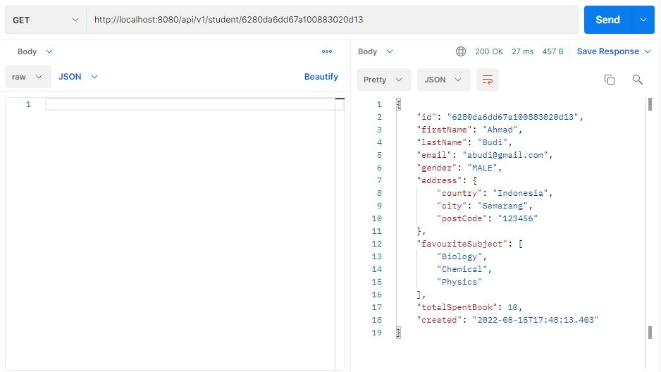
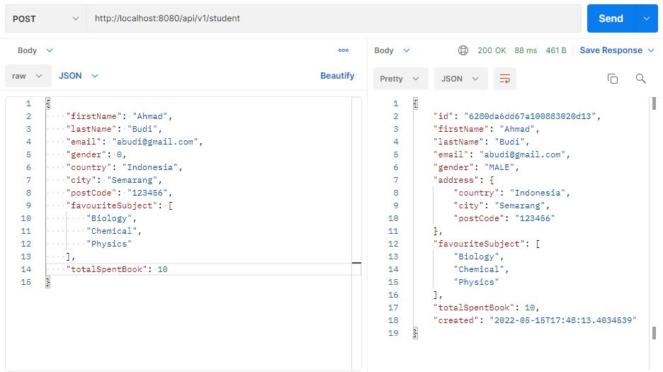
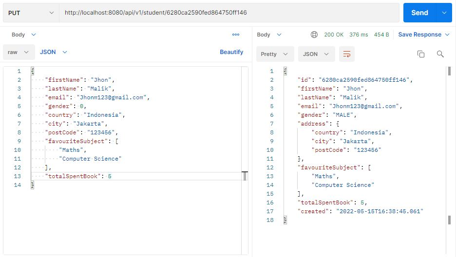
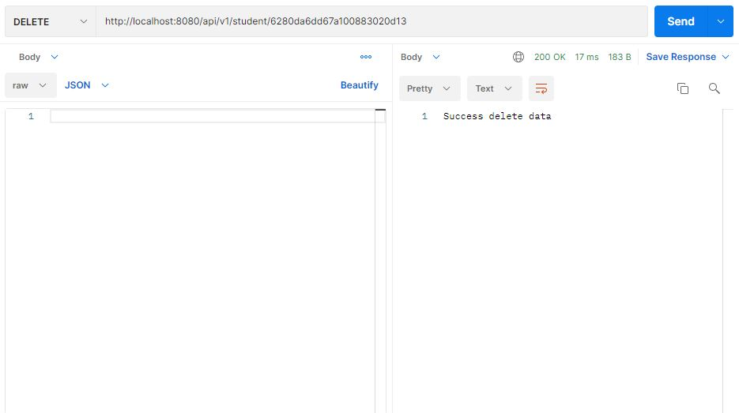

# Spring-Boot-Rest-API-with-MongoDB
## Build Rest API With Spring Boot Framework and MongoDB database

### Technology
* Maven 3.0+
* IDE(Eclipse or IntelliJ)
* JDK 14
* MongoDB database server
* Docker
* Postman for testing

### Configure Spring Datasource
**The configuration is in the application.properties file**

* Setting `spring.data.mongodb.username`, `spring.data.mongodb.password`, `spring.data.mongodb.database` & `spring.data.mongodb.port` properties are the same as your database installation.

### Configure Docker
**The configuration is in the docker.compose.yaml file**

## Test

* Get List Data

* Get Data By Id

* Post Data

* Update Data

* Delete Data

